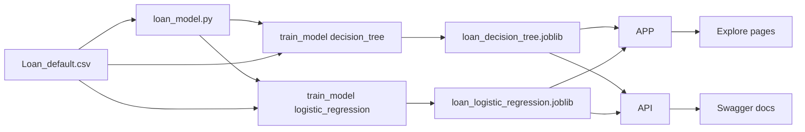

# LoanLens

LoanLens is a loan-risk exploration app built with Streamlit. It trains decision-tree and logistic-regression classifiers on `Loan_default.csv`, displays portfolio and model analysis, and exposes both models through a FastAPI service. The dataset contains default outcomes rather than recorded approval decisions; the app interprets predicted non-default likelihood as an approval estimate. The default model is the decision tree and the default approval threshold is 90%.

## Project layout

```text
Loan_Project/
├── app.py                    # Streamlit entry point and page navigation
├── app_pages/
│   ├── overview.py           # Portfolio KPIs and approval patterns
│   ├── data_analysis.py      # Filters, charts, and source records
│   ├── model_insights.py     # Metrics and feature importance
│   ├── predict.py            # Interactive loan prediction form
│   └── about.py              # In-app project guide
├── loan_model.py             # Data loading, training, saving, and prediction
├── model.py                  # Compatibility imports for loan_model.py
├── api.py                    # FastAPI service using loan_model.py
├── Loan_default.csv          # Training data
├── loan_logistic_regression.joblib # PCA-selected logistic-regression model and metrics
├── loan_decision_tree.joblib # Decision-tree pipeline and metrics
└── requirements.txt          # Python dependencies
```

## How the pieces connect



Both the Streamlit prediction page and the FastAPI `/predict` endpoint call `predict_one()` from `loan_model.py`. Each model is stored and loaded independently. The decision tree uses an 80/20 stratified split. Logistic regression is trained on PCA components; its component coefficients are projected back to rank the original fields and select five logistic-specific features. Selection and evaluation use a stratified 80/20 split, then the final model is refit on the full CSV.

## 1. Create the environment

From PowerShell:

```powershell
cd C:\Users\hp\C\Loan_Project
python -m venv .venv
.\.venv\Scripts\Activate.ps1
python -m pip install --upgrade pip
pip install -r requirements.txt
```

If PowerShell blocks activation, run the commands from an activated Python environment in VS Code instead, or use:

```powershell
.\.venv\Scripts\python.exe -m pip install -r requirements.txt
```

## 2. Train or retrain models

The training data must be saved as `Loan_default.csv` in this folder. Run this from the project directory:

```powershell
python -c "from loan_model import train_model; result = train_model(model_name='decision_tree'); print(result['metrics'])"
```

To train logistic regression, fit PCA and logistic regression on the training split, rank original fields using the projected logistic coefficients, evaluate the selected features on the holdout split, then refit and save the final model using the full CSV:

```powershell
python -c "from loan_model import train_model; result = train_model(model_name='logistic_regression'); print(result['features'], result['metrics'])"
```

The decision-tree training process:

1. Loads `Loan_default.csv`.
2. Uses `Default == 0` as the positive approval class.
3. Splits the data into an 80% training set and 20% test set.
4. Trains the decision tree on the selected numeric features.
5. Evaluates it using accuracy, ROC-AUC, classification report, and confusion matrix.
6. Saves the pipeline and test metrics to `loan_decision_tree.joblib`.

To change the decision-tree depth:

```powershell
python -c "from loan_model import train_model; result = train_model(model_name='decision_tree', max_depth=10); print(result['metrics'])"
```

Each model loads its own artifact. If an artifact is missing or predates the current bundle format, that model is trained automatically. Retrain both whenever the CSV changes.

The project pins scikit-learn to `1.6.1` because serialized scikit-learn models should be loaded with the same scikit-learn version used to create them. If dependencies change, retrain the model in the active project environment before starting the app.

## Dataset contract

The current CSV must contain these columns. PCA plus logistic-regression coefficients rank the numeric columns; logistic regression uses its five highest-ranked features. This supervised ranking is separate from decision-tree feature importance.

### Numeric columns

```text
Age
Income
LoanAmount
CreditScore
MonthsEmployed
NumCreditLines
InterestRate
LoanTerm
DTIRatio
```

### Categorical columns

```text
Education
EmploymentType
MaritalStatus
HasMortgage
HasDependents
LoanPurpose
HasCoSigner
```

### Target and identifier

```text
Default   # 0 = did not default, 1 = defaulted
LoanID    # identifier; not used as a model feature
```

When replacing the CSV, preserve the column names and value types, then retrain the model. The model internally maps `Default == 0` to non-default likelihood; the prediction UI presents this as an approval estimate, not as a separately trained or recorded approval decision.

The source data does not contain a separate loan-approval decision. Portfolio rates derived from `Default == 0` are therefore described as non-default rates, not historical approval rates.

The prediction page displays only the features used by the currently selected model. The API accepts all numeric features and validates that each selected model's required feature values are present.

## 3. Run the Streamlit app

```powershell
streamlit run app.py
```

Open the URL printed by Streamlit, normally:

```text
http://localhost:8501
```

Available pages:

- **Overview**: application count, historical non-default rate, portfolio summary, and default-model metrics.
- **Data analysis**: filter the dataset and inspect distributions.
- **Model insights**: select a model to inspect its metrics and feature interpretation.
- **Predict a loan**: select a model, set a threshold (default 90%), and score an application.
- **Project guide**: in-app usage notes.

## 4. Run the FastAPI service

Open a second terminal, activate the same environment, and run:

```powershell
cd C:\Users\hp\C\Loan_Project
.\.venv\Scripts\Activate.ps1
uvicorn api:app --reload --port 8000
```

The API will be available at:

```text
http://localhost:8000
```

Interactive API documentation is available at:

```text
http://localhost:8000/docs
```

The API loads the same separate model artifacts used by Streamlit. Retrain both models before testing the API after changing the CSV.

## API endpoints

### Health check

```http
GET /health
```

PowerShell:

```powershell
Invoke-RestMethod http://localhost:8000/health
```

### Model information

```http
GET /model-info
```

PowerShell:

```powershell
Invoke-RestMethod http://localhost:8000/model-info
```

This returns the saved evaluation metrics and feature list for each model.

### Predict an application

```http
POST /predict
Content-Type: application/json
```

Example request:

```json
{
  "Age": 30,
  "Income": 60000,
  "LoanAmount": 10000,
  "CreditScore": 700,
  "MonthsEmployed": 48,
  "NumCreditLines": 3,
  "InterestRate": 11.0,
  "LoanTerm": 36,
  "DTIRatio": 0.25,
  "threshold": 0.9,
  "model": "logistic_regression"
}
```

PowerShell request:

```powershell
$body = @{
    Age = 30
    Income = 60000
    LoanAmount = 10000
    CreditScore = 700
    MonthsEmployed = 48
    NumCreditLines = 3
    InterestRate = 11.0
    LoanTerm = 36
    DTIRatio = 0.25
    threshold = 0.9
    model = "logistic_regression"
} | ConvertTo-Json

Invoke-RestMethod `
    -Uri http://localhost:8000/predict `
    -Method Post `
    -ContentType "application/json" `
    -Body $body
```

Typical response fields:

```json
{
  "loan_status": 1,
  "approval_probability": 0.72,
  "threshold": 0.9,
  "model": "logistic_regression",
  "model_label": "Logistic regression",
  "decision": "Likely approved"
}
```

`loan_status` is the model decision after applying the threshold: `1` means likely approved and `0` means likely declined. This is a model screening result, not an automatic credit decision.

For decision-tree predictions, the response additionally includes the tree leaf, leaf sample count, and leaf approval rate. Set `model` to `logistic_regression` to load and use the PCA-selected logistic model; the `/model-info` endpoint lists its required features.

## Recommended update workflow

Whenever a newer CSV is provided:

```powershell
cd C:\Users\hp\C\Loan_Project
.\.venv\Scripts\Activate.ps1
python -c "from loan_model import train_model; print(train_model(model_name='decision_tree')['metrics'])"
python -c "from loan_model import train_model; print(train_model(model_name='logistic_regression')['metrics'])"
streamlit run app.py
```

Run the API separately when API access is needed:

```powershell
uvicorn api:app --reload --port 8000
```

Keep `Loan_default.csv`, `loan_model.py`, the Streamlit app, and the API schema in sync. If the dataset columns change again, update `NUMERIC_FEATURES`, `CATEGORICAL_FEATURES`, the prediction form, and `LoanApplication` before retraining.

## Model evaluation

The model insights page displays accuracy, ROC-AUC, confusion matrices, and model-specific feature interpretation. Logistic regression's PCA components and coefficient-based feature ranking are fit on the training split; reported metrics use a separate holdout split, and the deployed estimator is refit on the full CSV. Recalculate these metrics after every data update. The result is an educational screening estimate, not an automatic credit decision.
